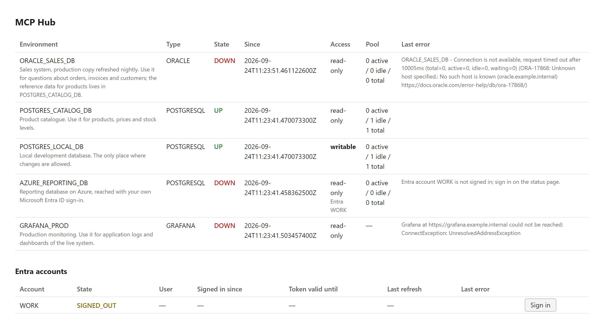

# MCP Hub

[](https://github.com/lubos-svoboda/mcp-hub/actions/workflows/build.yml)
[](https://github.com/lubos-svoboda/mcp-hub/pkgs/container/mcp-hub)

One long-running [MCP](https://modelcontextprotocol.io) server that gives AI assistants access
to several Oracle and PostgreSQL databases and Grafana instances through a single set of tools,
shared by every client session on the machine.

## Features

- **One set of tools for every environment.** Each tool takes an `environment` parameter instead
  of being repeated once per database, so ten environments cost the client's context no more than
  one.
- **Shared by every session.** The server speaks streamable HTTP, so every editor window and
  every assistant session on the machine uses the same process and the same connections.
- **Three kinds of environment:** Oracle, PostgreSQL and Grafana (logs from Loki and the Grafana
  HTTP API), all configured in one list.
- **Microsoft Entra ID sign-in for Azure Database for PostgreSQL.** Sign in once on the status
  page; the server renews the access token on its own, so no connection drops when a token
  expires and nothing needs reconnecting.
- **A connection pool per database**, sized per environment, with idle connections exercised
  regularly so that a connection closed by a firewall is replaced before a query reaches it.
- **Background connection and automatic recovery.** The server starts even when nothing can be
  reached, keeps retrying for as long as it runs, and picks an environment up as soon as it
  becomes reachable. Nothing needs restarting after a VPN reconnect.
- **Visible connection state.** Every environment is probed on a schedule. The state, the time
  it began and the last error are remembered and reported by `list_environments`, on a status
  page, and in every failed query.
- **Reading cannot write.** Queries run inside a read-only transaction, so the database itself
  refuses any write, including one hidden in a PL/SQL block. Changes go through separate tools that
  work only on environments configured as writable.
- **Guarded answers.** Limits on rows, answer size, text length and query time, per environment,
  and every answer says when a limit cut something off.
- **Schema tools:** table descriptions, name search, stored program and view source and
  execution plans, answered straight from the data dictionary with no cache to build or go stale.
- **A log line for every call** with its arguments, duration and outcome.

## Why

The usual way to give an assistant access to several databases is one MCP server process per
database, spoken to over `stdio`. That has three drawbacks:

- **The tools are duplicated.** Each server repeats the same tools under its own prefix, so four
  databases mean four copies of every tool definition in the client's context.
- **Every client session pays for its own processes.** `stdio` is a one-to-one pipe between a
  client and a process, so each editor window starts its own servers and opens its own database
  connections.
- **Connection state is invisible.** A failure surfaces only on the query that hit it, and
  nothing records which databases are reachable or why one is not.

## Quick start

With Docker and nothing else installed:

1. Create a configuration directory `~/.mcp-hub/` with `application.yaml` and `secrets.env`, as
   described under [Configuration](#configuration). [`examples/`](examples) holds both files,
   ready to copy.
2. Start the published image:

   ```bash
   docker run -d --name mcp-hub --restart unless-stopped -p 127.0.0.1:8282:8282 -v ~/.mcp-hub:/config:ro --env-file ~/.mcp-hub/secrets.env ghcr.io/lubos-svoboda/mcp-hub
   ```

- On Windows, write the full path instead of `~`, for example `C:/Users/you/.mcp-hub`.
- On Linux, add `--add-host host.docker.internal:host-gateway` when a database runs on the
  machine itself. Docker Desktop defines that name on its own.

Open <http://127.0.0.1:8282/> to see the state of every environment, then
[connect a client](#connecting-a-client).

## Configuration

The configuration lives outside the repository, in a directory of your own such as
`~/.mcp-hub/`:

```
~/.mcp-hub/
  application.yaml   environments and limits; refers to credentials by variable name
  secrets.env        the credentials themselves, one VARIABLE=value per line
  certs/             optional: certificates of private authorities, for Grafana over HTTPS
```

[`examples/`](examples) holds a complete starting point.

Every environment is an entry under `mcp-hub.environments`. Its key is the name every tool
expects, and it is a free label: the same database may appear twice under different accounts,
and nothing is ever inferred from the name.

```yaml
mcp-hub:
  environments:
    ORACLE_SALES_DB:
      type: ORACLE
      description: Sales system. Use it for orders, invoices and customers.
      url: jdbc:oracle:thin:@//oracle.example.internal:1521/SALES
      username: ${ORACLE_SALES_USERNAME}
      password: ${ORACLE_SALES_PASSWORD}
```

### Properties of every environment

| Property | Required | Purpose |
|---|---|---|
| `type` | yes | `ORACLE`, `POSTGRESQL` or `GRAFANA`. Selects how the environment is reached. |
| `description` | yes | Shown to the assistant by `list_environments`. See [writing a description](#writing-a-description). |
| `url` | yes | JDBC URL of a database, or base address of a Grafana instance. |
| `read-only` | no | `true` by default. Only `false` lets the writing tools change anything. |
| `authentication` | no | `PASSWORD` by default. `ENTRA` signs a PostgreSQL environment in with Microsoft Entra ID; see [Microsoft Entra ID](#microsoft-entra-id). |
| `entra-account` | with `ENTRA` | The entry under `mcp-hub.entra-accounts` to sign in with. |

### Writing a description

`list_environments` hands the description to the assistant, and it is the only thing that tells
two similar environments apart. Write it as a hint about when to use the environment rather
than as a label:

```yaml
description: >-
  Sales system, production copy refreshed nightly. Use it for questions about orders,
  invoices and customers; product reference data lives in POSTGRES_CATALOG_DB.
```

### Oracle

```yaml
ORACLE_SALES_DB:
  type: ORACLE
  description: Sales system. Use it for orders, invoices and customers.
  url: jdbc:oracle:thin:@//oracle.example.internal:1521/SALES
  username: ${ORACLE_SALES_USERNAME}
  password: ${ORACLE_SALES_PASSWORD}
  schema: SALES
```

- `username` and `password` are required.
- `schema` is optional and limits the schema tools to one owner, written in upper case as the
  dictionary stores it. Without it they cover every schema the account can see.
- The thin driver is used, so no Oracle client installation and no `NLS_LANG` are needed.
  Databases on regional character sets such as `EE8ISO8859P2` are supported.
- `get_query_plan` reads the cursor cache and needs `SELECT_CATALOG_ROLE` or an equivalent grant
  on `V$SQL`. Everything else works with a plain account.
- For TLS, use a `jdbc:oracle:thin:@tcps://…` URL with the driver's usual properties.

### PostgreSQL

```yaml
POSTGRES_CATALOG_DB:
  type: POSTGRESQL
  description: Product catalogue. Use it for products, prices and stock levels.
  url: jdbc:postgresql://postgres.example.internal:5432/catalog
  username: ${POSTGRES_CATALOG_USERNAME}
  password: ${POSTGRES_CATALOG_PASSWORD}
  schema: catalog
```

- `username` and `password` are required.
- `schema` is optional and limits the schema tools to one schema. Without it they cover every
  schema except the system catalogs.
- For TLS, add the driver's parameters to the URL, for example
  `?sslmode=verify-full&sslrootcert=/config/certs/ca.pem`.

### Microsoft Entra ID

Azure Database for PostgreSQL can admit users by their Microsoft Entra ID sign-in instead of a
password. Such an environment names an Entra account; you sign in once on the
[status page](#status-page), and from then on the server renews the access token on its own.

```yaml
mcp-hub:
  entra-accounts:
    WORK:
      tenant-id: 00000000-0000-0000-0000-000000000000
      expected-user: you@example.com
  environments:
    AZURE_REPORTING_DB:
      type: POSTGRESQL
      description: Reporting database on Azure. Use it for monthly figures.
      url: jdbc:postgresql://reporting.postgres.database.azure.com:5432/reporting?sslmode=require
      username: app_readers
      authentication: ENTRA
      entra-account: WORK
```

| Property of an account | Required | Purpose |
|---|---|---|
| `tenant-id` | yes | The directory the account belongs to, as `az account show --query tenantId` prints it. A sign-in into any other tenant is refused. |
| `expected-user` | no | When set, a sign-in by anybody else is refused, so one account cannot stand in for another. |
| `client-id` | no | The application that signs in. See [the client ID](#the-client-id). |

- `username` is the database role the token is mapped to: your own user principal name, or the
  name of an Entra group that was made a principal of the database. There is no password.
- Only `POSTGRESQL` environments can use `ENTRA`. Oracle and Grafana refuse it at startup.
- Every environment naming the same account shares its sign-in, so several databases reached as
  the same person need only one. A second account is needed only for a different user or a
  different tenant. The subscription `az account set` selects plays no part in a database token.
- Every connection is tagged with the `application_name` `mcp-hub/<signed-in user>`. The database
  often knows only the group it was reached as, and this tells who is behind a session.

**Signing in.** Until an account is signed in, its environments are down with the reason
`Entra account WORK is not signed in; sign in on the status page.`

```
/status ─ Sign in ─▶ Microsoft sign-in in your browser (MFA, …) ─▶ back to /status
                     └ answer posted to http://localhost:<port>/     environments up within seconds

new connection ─▶ current access token ─ runs out within 5 minutes? ─▶ renewed with the refresh token
```

Access tokens live 60 to 90 minutes and are renewed shortly before they run out. A connection
already established is not affected when its token expires, because the database checks the
token only when a connection signs in. You have to sign in again only when:

- **the server restarts**, because tokens are kept in memory only and never written to disk;
- **Entra refuses the refresh token**, for example when your organisation's sign-in frequency runs
  out, after a password change or when your sessions are revoked. The account then turns to
  `SIGN_IN_REQUIRED`, and the status page shows Entra's reason.

**Signing out** on the status page forgets the tokens and closes the pooled connections, so that
nothing keeps using the sign-in.

#### The client ID

Signing in needs an application registered in Entra ID. The default `client-id` is the public
client of the Azure CLI, `04b07795-8ddb-461a-bbee-02f9e1bf7b46`, which every tenant already knows
and which may request tokens for Azure databases. No registration and no administrator consent
are needed, and the Azure identity libraries use the same default. Sign-ins then appear in the
Entra logs as the Azure CLI, and the same Conditional Access policies apply.

If your organisation wants tools to use a registration of their own, register a public client
with the redirect URI `http://localhost` and the delegated permission *Azure OSSRDBMS Database →
user_impersonation*, and put its ID into `client-id`.

Entra answers on the root of the server, `http://localhost:<port>/`, because that is the
redirect URI the Azure CLI registers: `localhost` with any port and no path. The port is the one
your browser used to open the status page, so a container port published under another number
works as well.

### Grafana

```yaml
GRAFANA_PROD:
  type: GRAFANA
  description: Production monitoring. Use it for logs and dashboards of the live system.
  url: https://grafana.example.internal/
  token: ${GRAFANA_PROD_TOKEN}
  ca-file: /config/certs/internal-ca.pem
```

- `token` is required: a
  [service account token](https://grafana.com/docs/grafana/latest/administration/service-accounts/).
  The Viewer role is enough for reading; `grafana_api_write` needs Editor on a writable instance.
- `ca-file` is optional. It names a PEM file, which may hold several certificates, and the
  instance then trusts exactly those instead of the JVM's default authorities. Use it when the
  instance's certificate is signed by a private authority. The path is the one the server sees:
  in Docker the configuration directory is mounted at `/config`.
- Logs are read from the first Loki datasource the instance lists, through Grafana's datasource
  proxy, so the one token serves both.
- Redirects are not followed and every endpoint stays on the configured address, because the token
  travels with each request. If Grafana answers with a redirect, point `url` at the final address.

### Limits and pool sizing

Every value below has a built-in default. Override it for all environments under
`mcp-hub.defaults`, or for one environment next to its `url`:

```yaml
mcp-hub:
  defaults:
    max-rows: 200
  environments:
    ORACLE_SALES_DB:
      max-rows: 50
      pool:
        maximum-size: 2
```

| Setting | Default | Purpose |
|---|---|---|
| `max-rows` | 500 | Largest number of rows a query returns. |
| `query-timeout-seconds` | 60 | Cancels a statement that runs too long. |
| `max-response-characters` | 100000 | Stops building an answer once it grows past this. Applies to Grafana answers too. |
| `max-text-value-characters` | 4000 | Longest single text value; longer ones are cut. |
| `max-source-lines` | 1000 | Lines of stored program source per call. |
| `connect-timeout-seconds` | 10 | Gives up on an unreachable host instead of waiting for the operating system. |
| `socket-read-timeout-seconds` | 120 | Gives up when a connected server stops answering. For Grafana, the request timeout. |
| `pool.maximum-size` | 5 | Connections per database. |
| `pool.minimum-idle` | 1 | Connections kept open and ready. |
| `pool.keepalive-seconds` | 120 | How often an idle connection is exercised. |
| `pool.validation-timeout-seconds` | 5 | How long a liveness check may take. |

Two settings apply to the whole server and sit directly under `mcp-hub`:

| Setting | Default | Purpose |
|---|---|---|
| `probe.interval-seconds` | 15 | How often every environment is checked. |
| `allowed-hosts` | `localhost`, `127.0.0.1`, `::1` | Host names the server answers to. Add one, for example `host.docker.internal`, only when a client reaches the server under that name. |

## Tools

| Tool | Environments | Purpose |
|---|---|---|
| `list_environments` | all | Every environment with its type, description, state, since when it holds, the last error, whether it is read-only and pool usage, and for an Entra environment the state of its sign-in. |
| `run_sql_query` | databases | Runs one query in a read-only transaction and returns the rows. |
| `describe_table` | databases | Columns with types as DDL writes them, nullability, keys, check constraints and indexes, for several tables at once. |
| `search_schema` | databases | Finds tables, views, columns and stored programs whose name contains a fragment. |
| `get_object_source` | databases | Source of a stored program or the defining query of a view, as one text, paged by line for long packages. |
| `get_query_plan` | databases | Execution plan. PostgreSQL plans the statement given with `EXPLAIN`; Oracle cannot write to `PLAN_TABLE` read-only, so it reads the plan of a statement that already ran from the cursor cache. |
| `execute_write_statement` | writable databases | Runs and commits one statement that changes data or structure. |
| `query_logs` | Grafana | Runs a LogQL query against Loki. |
| `list_log_labels` | Grafana | Log label names, or the values of one label. |
| `grafana_api_request` | Grafana | Reads any Grafana HTTP API endpoint, narrowed by an optional jq expression. |
| `grafana_api_write` | writable Grafana | Changes something through the Grafana API, for example saves a dashboard. |

Each tool carries the MCP hints `readOnlyHint` and `destructiveHint`, so a client can ask for
confirmation before the two writing tools run.

A query answer lists the column names once and every row as an array of values, which costs far
fewer tokens than repeating the names on every row:

```json
{
  "environment": "ORACLE_SALES_DB",
  "readOnly": true,
  "columns": ["ID", "AMOUNT", "CREATED_AT", "NOTE"],
  "rows": [["1", "12345678901234567890.123", "2026-03-15T08:00:45", null]],
  "rowCount": 1,
  "notes": []
}
```

Every value is text, so a number keeps precision a double would lose. Dates and timestamps are
ISO-8601 exactly as stored, never shifted into the server's time zone. `CLOB` and long text are
cut at `max-text-value-characters`, binary values are reported by their size only, and `null`
stays `null`. `notes` says whenever a limit cut the answer short.

A failed call comes back as a tool error carrying the database's or Grafana's own message,
unchanged. When the environment was already known to be down, the error adds since when and
why.

## Status page



| Address | Content |
|---|---|
| <http://127.0.0.1:8282/status> | Every environment with its state, since when it holds, access mode, pool usage and last error, and every Entra account with its state, user, token expiry, last refresh and last error, with a button to sign in or out. Refreshes itself every 10 seconds. `/` redirects here. |
| <http://127.0.0.1:8282/status.json> | The same as JSON, for scripts and monitoring. |

## Logging

The log is where the server is watched from, so every tool call leaves two lines, numbered to
tie them together when sessions interleave:

```
#7 → run_sql_query(ORACLE_SALES_DB, select id, amount from orders where id = 1)
#7 ← run_sql_query ok in 42 ms, 1 row(s)
#8 → execute_write_statement(POSTGRES_LOCAL_DB, update products set price = 10 where id = 3)
#8 ✗ execute_write_statement failed in 3 ms: ERROR: relation "products" does not exist
```

Arguments are logged shortened to one line, so a query's text appears in the log. A change of an
environment's state is logged once, when it happens, not on every probe. Every committed write
is logged with its whole statement, and every change made in Grafana with its method and endpoint.
Every Entra sign-in and sign-out is logged with the account, the user and the tenant, and so is a
refresh token Entra refuses. Tokens never appear in the log.

## Running

### Docker

The [quick start](#quick-start) runs the published image with `docker run`. The configuration
directory is mounted read-only at `/config`, and `secrets.env` inside it supplies the credentials.
Moving to a newer release means pulling it and starting the container again:

```bash
docker pull ghcr.io/lubos-svoboda/mcp-hub
docker rm -f mcp-hub
```

Then run the `docker run` command from the quick start again. Name a version such as
`ghcr.io/lubos-svoboda/mcp-hub:0.1.1` instead to stay on one release.

### Docker Compose

A clone of this repository runs the same image with Docker Compose, which keeps the settings in
[`compose.yaml`](compose.yaml) and can build the image from the source:

```bash
git clone https://github.com/lubos-svoboda/mcp-hub.git && cd mcp-hub
echo "MCP_HUB_CONFIG=$HOME/.mcp-hub" > .env
docker compose up -d           # the newest release
docker compose up -d --build   # or an image built from the source
```

On Windows, create `.env` by hand and write the path with forward slashes, for example
`MCP_HUB_CONFIG=C:/Users/you/.mcp-hub`; see [`.env.example`](.env.example). Without
`MCP_HUB_VERSION` in `.env`, Compose runs the newest release, and `docker compose pull` followed
by `docker compose up -d` moves to a newer one. Set `MCP_HUB_VERSION`, for example to `0.1.1`, to
stay on one release until you change it.

Either way, the published port is bound to `127.0.0.1`, so nothing outside the machine can reach
the server, and the restart policy `unless-stopped` brings it back after a reboot, before the
first client asks for it.

A database running on the host itself is reached as `host.docker.internal`.

**On Linux** the container runs as a system user of its own, not as you, so it must be able to
read the configuration directory. If it cannot, the server refuses to start and the log says
`Config data resource 'file [/config/application.yaml]' … does not exist`, even though the file is
there. Open it up for reading:

```bash
chmod 755 ~/.mcp-hub
chmod 644 ~/.mcp-hub/application.yaml
chmod -R a+rX ~/.mcp-hub/certs    # only if you keep certificates there
```

`secrets.env` can stay readable by you only: `docker run --env-file` and Docker Compose both read
it on the host and hand the values to the container as environment variables.

### Without Docker

Any JDK from 17 on runs the Gradle wrapper, which fetches everything else, including a Java 25
toolchain for the build when none is installed. The server reads `secrets.env` itself, as a
properties file:

```bash
./gradlew bootRun --args="--spring.config.additional-location=file:$HOME/.mcp-hub/application.yaml --spring.config.import=file:$HOME/.mcp-hub/secrets.env[.properties]"
```

The server then listens on `127.0.0.1:8282`. Certificate paths in `ca-file` are paths on your
machine in this case, not under `/config`.

A backslash in `secrets.env` means something different in each case: Docker takes it
literally, while the properties format treats it as the start of an escape sequence. Without
Docker, write a password containing a backslash with the backslash doubled.

## Connecting a client

The MCP endpoint is `http://127.0.0.1:8282/mcp`. For Claude Code, in `.mcp.json`:

```json
{
  "mcpServers": {
    "mcp-hub": {
      "type": "http",
      "url": "http://127.0.0.1:8282/mcp"
    }
  }
}
```

## How it works

```
 client sessions ──HTTP──▶ /mcp ──▶ tools ──▶ read-only session ──▶ pool ──▶ Oracle / PostgreSQL
                                       │     └▶ write runner (writable only)
                                       └──────▶ Grafana HTTP API ──▶ Loki
                        ConnectionProbe ── probes every target on a schedule, keeps its state
                        /status ────────── shows that state
```

The decisions behind it:

- **Streamable HTTP, not `stdio`.** `stdio` connects one client to one process and cannot be
  shared. It would also share its pipe with anything written to standard output, such as the
  startup banner.
- **Read-only is enforced by the database, not by inspecting SQL.** Every query runs in a
  transaction opened with `SET TRANSACTION READ ONLY` and is always rolled back. Looking for
  forbidden keywords would miss a write inside a PL/SQL block, in `SELECT … FOR UPDATE` or inside
  a called procedure; the transaction does not. A database account allowed only to `SELECT` adds
  a second, independent layer for environments that must never change.
- **Writing is a separate tool, not a mode.** A caller cannot slide into writing by accident; it
  has to reach for a differently named tool, and only a writable environment accepts it. An
  environment being writable does not weaken any other.
- **State is remembered, errors are passed on verbatim.** The reason an environment is down is
  stored, so a question asked minutes later still gets it. Driver messages such as `ORA-12541`
  are forwarded unchanged rather than translated.
- **Connecting never gives up.** Pools are created without waiting for the database, the probe
  reconnects in the background, and idle connections are validated with a timeout of their own so
  that a dead connection cannot block the pool.
- **Credentials never leave the configuration.** They are not part of the URL, not part of the
  resolved settings the tools see, and not part of any message or log line.
- **Entra tokens stay in memory.** The refresh token is a lasting key to the database, so it is
  never written to disk; signing in again after a restart is the price.
- **No schema cache.** A filtered data dictionary query answers in a fraction of a second even
  over hundreds of thousands of columns, so there is nothing a cache would save and nothing to
  go stale.

## Development

```bash
./gradlew test             # unit tests, seconds
./gradlew integrationTest  # real Oracle, PostgreSQL, Grafana and Loki in Docker, a few minutes
```

The integration tests cover what unit tests cannot: that a write is refused by the database
itself, that values keep their type and precision, that Czech diacritics survive both ways, that
an environment recovers on its own after its database goes away and comes back, and that logs
are read from Loki through Grafana's datasource proxy with a token of the Viewer role.

### Continuous integration

| Event | What runs |
|---|---|
| Push to `main` | Unit tests. |
| Pull request to `main` | Unit tests, integration tests and a build of the Docker image. |
| Tag `v*` | Every test, then the release described below. |

The integration tests take minutes because of the Oracle container, which is why a push to
`main` does not wait for them.

### Versions and releases

The version comes from git tags, so no file holds it:

| Build | Version |
|---|---|
| On a tagged commit, for example `v0.1.0` | `0.1.0` |
| Three commits after that tag | `0.1.0-3-gd2fd529`, with `-dirty` when there are uncommitted changes |
| Without git, for example `docker compose up --build` | `0.0.0-dev` |

The server reports it to every client when a session starts.

To release, tag the commit and push the tag:

```bash
git tag v0.2.0
git push origin v0.2.0
```

The [release workflow](.github/workflows/release.yml) then runs every test and publishes the
image for `linux/amd64` and `linux/arm64` to `ghcr.io/lubos-svoboda/mcp-hub` as `0.2.0`, `0.2`
and `latest`.

## Limitations

- **Meant for localhost.** There is no authentication; keep the port bound to the loopback
  interface. A web page open in your browser could still reach a server on localhost, directly or
  through DNS rebinding, so every request addressed to a host name outside `allowed-hosts` or
  sent from a foreign web page (its `Origin` header) is refused. The one exception is Entra
  posting its sign-in answer to the root.
- **Character sets are covered by a dependency, not a test.** The test database runs on
  `AL32UTF8`, which the thin driver handles on its own, so no test can fail the way a database on
  a regional character set would. The `orai18n` dependency covers that case; without it such a
  database refuses every connection with `ORA-17056`.
- **The sign-in to Entra ID itself is not tested automatically.** No test can sign in to a real
  directory, so the tests put a stand-in in place of Entra and let the database accept its token
  as a password. Everything around the sign-in is covered that way: renewing, refusing, signing
  out and tagging connections. The conversation with Entra and your organisation's Conditional
  Access policies are verified by hand only.
- **Entra sign-in is for Azure Database for PostgreSQL only.** The token is requested for the
  resource Azure's open-source databases share; Oracle and Grafana do not accept it.
- **A running statement cannot be cancelled** from the client. It ends at the query timeout,
  because the MCP Java SDK the server is built on does not handle the protocol's cancellation
  notification yet.

## License

[Apache License 2.0](LICENSE)
